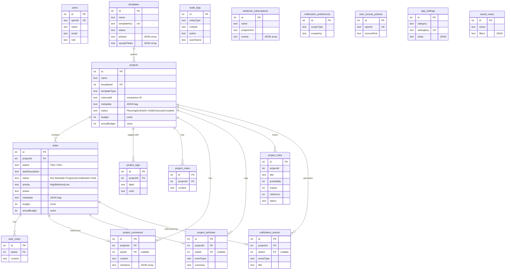

# Darwin TaskLine — Architecture Guide

A comprehensive developer guide covering the full system: architecture, data model, page map, component tree, auth/webhook flows, and development workflow.

---

## 1. System Overview

Darwin TaskLine is a project management application built for capital infrastructure and government work. It tracks projects, tasks, budgets, milestones, risks, and governance across a portfolio.

| Layer | Technology |
|-------|-----------|
| Frontend | React 19 + TypeScript, Vite, wouter (routing), shadcn/ui components |
| API | tRPC v11 (end-to-end type-safe RPC) |
| Backend | Node.js + Express, TypeScript |
| Database | SQLite via Drizzle ORM |
| Serialization | SuperJSON (dates, bigints) |
| Auth | OAuth via external provider (configurable) |
| Testing | Vitest |

---

## 2. Architecture Diagram


---

## 3. Data Model

### Entity Relationship Diagram



### Key Relationships

| Parent | Child | Relationship | On Delete |
|--------|-------|-------------|-----------|
| templates | projects | 1:N (optional) | SET NULL |
| projects | tasks | 1:N | CASCADE |
| projects | project_tags | 1:N | CASCADE |
| projects | project_notes | 1:N | CASCADE |
| projects | project_comments | 1:N | CASCADE |
| projects | project_activities | 1:N | CASCADE |
| projects | notification_events | 1:N | CASCADE |
| tasks | task_notes | 1:N | CASCADE |
| tasks | project_comments | 1:N (nullable FK) | SET NULL |

### Conventions

- **Timestamps**: Unix epoch integers (seconds since 1970)
- **Currency**: Stored as integers in cents ($125.50 → `12550`)
- **Enums**: Stored as text. Project/task statuses, priorities, and risk statuses are configurable via Admin → Statuses & Labels tab. Defaults are defined in `shared/enums.ts` and seeded into `app_settings`. Validation at the Zod schema layer uses `z.string()` for configurable fields.
- **JSON fields**: Stored as text, parsed by application code
- **IDs**: Auto-increment integers (SQLite `integer primary key`)

---

## 4. Page Map


| Route | Page | Key Features |
|-------|------|-------------|
| `/` | Dashboard | Portfolio KPIs, health grid, top risks, recent projects, upcoming deadlines |
| `/projects` | Projects | Card/table grid, status filter, search, health filter |
| `/projects/new` | CreateProject | Template picker → details form → auto-task creation |
| `/projects/:id` | ProjectDetail | Info card, risk register, task table (filter/sort/bulk edit), activity feed, notes, Gantt-on-page |
| `/templates` | Templates | Template card/table grid, task library editor, import/export JSON |
| `/calendar` | Calendar | react-big-calendar with project/task toggle, color-coded by status/phase |
| `/tasks` | Tasks | Cross-project task table with status/priority filters, bulk actions |
| `/gantt` | GanttChart | Hierarchical timeline (projects → phases → tasks) |
| `/admin` | AdminSettings | Branding, governance, webhooks, access policies, saved views, notification prefs |

---

## 5. Server Module Map


### Module Sizes (complexity indicators)

| Module | Lines | Notes |
|--------|-------|-------|
| `server/db.ts` | ~2,100 | Data access for all 16 tables. Candidate for decomposition into domain repositories |
| `server/routers.ts` | ~1,600 | All tRPC procedures. Candidate for splitting into feature routers |
| `client/src/pages/ProjectDetail.tsx` | ~1,226 | Heaviest UI page. Could split into section components |
| `client/src/pages/Templates.tsx` | ~651 | Template management with inline task editor |
| `client/src/pages/Tasks.tsx` | ~600 | Cross-project task view with bulk editing |

---

## 6. Frontend Component Tree


---

## 7. Authentication & Authorization


### Role-Based Access

| Role | Capabilities |
|------|-------------|
| Admin | Full access: create/edit/delete projects, templates, settings, governance |
| Editor | Create/edit projects and tasks. No access to admin settings or governance |
| Viewer | Read-only access to all data |

Access policies are stored in `user_access_policies` and managed via the Admin panel.

---

## 8. Webhook & Governance Pipeline


### Webhook Payload Shape

```json
{
  "event": "project.updated",
  "entityType": "project",
  "entityId": "42",
  "action": "project.update",
  "actorName": "John Doe",
  "actorOpenId": "user-123",
  "entity": { "id": 42, "name": "Main St CIP", "status": "Closeout", "..." }
}
```

---

## 9. Template System


- Templates define reusable project blueprints with phases and sample tasks
- When a project is created from a template, tasks are auto-generated with sequential IDs
- Templates support versioning (`createVersion`), publishing (`publish`), and archiving (`archive`)
- Import/export via JSON for sharing template libraries

---

## 10. Integration Points

| Point | Field / Endpoint | Direction | Purpose |
|-------|-----------------|-----------|---------|
| External ID | `projects.externalId` | Companion → TaskLine | Correlation ID for external systems |
| Metadata | `projects.metadata`, `tasks.metadata` | Companion → TaskLine | Domain-specific JSON data bag |
| Budget actuals | `projects.actualBudget`, `tasks.actualBudget` | Companion → TaskLine | Financial tracking push |
| Tags | `tags.add` / `tags.remove` | Companion → TaskLine | Visual status indicators |
| Webhooks | `webhook_subscriptions` | TaskLine → Companion | Event-driven notifications with entity snapshots |
| Closeout status | `projects.status = "Closeout"` | Bidirectional | Administrative wind-down phase |
| Configurable Enums | `enums.list` / `enums.update` | Admin → TaskLine | Dynamic status/priority/risk options |

See [INTEGRATION_GUIDE.md](INTEGRATION_GUIDE.md) for implementation details and code examples.

---

## 11. Development Workflow

### Commands

| Command | Purpose |
|---------|---------|
| `pnpm install` | Install dependencies |
| `pnpm dev` | Start dev server (hot reload) |
| `npm run check` | TypeScript type check (`tsc --noEmit`) |
| `npm run test` | Run Vitest test suite |
| `npm run build` | Production build (Vite + esbuild) |
| `npm run verify` | Full gate: check + test + build |
| `pnpm db:push` | Apply schema to SQLite |
| `pnpm db:seed` | Seed database with sample data |

### Branch Model

| Branch | Purpose |
|--------|---------|
| `main` | Production-ready code |
| `gen2` | Current development branch |
| `staging` | Release validation |

### CI Pipeline

GitHub Actions runs on push/PR: `install → check → test → build`

### Preflight (before any commit)

```bash
npm run verify   # Must pass before committing
```

---

## 12. Module Decomposition Roadmap

These are known structural improvements tracked for future work:

| Current Module | Planned Split | Rationale |
|---------------|--------------|-----------|
| `server/db.ts` (2,100 lines) | Domain repositories: `projectRepo.ts`, `taskRepo.ts`, `templateRepo.ts`, etc. | Reduce change risk, enable focused testing |
| `server/routers.ts` (1,600 lines) | Feature routers: `projectRouter.ts`, `taskRouter.ts`, `templateRouter.ts`, composed in `routers.ts` | Smaller review surface per feature |
| `ProjectDetail.tsx` (1,226 lines) | Container + section components: `ProjectInfo`, `TaskTable`, `ActivityFeed`, `RiskRegister` | Reduce cognitive load, enable lazy loading |
| ~~Hardcoded status enums~~ | ~~DB-driven config table + shared constants~~ | ✅ **Done** — `shared/enums.ts` + `EnumContext` + Admin Statuses & Labels tab |
