# Darwin TaskLine — MVP Product Requirements Document

## Document Control

| Field | Value |
|-------|-------|
| Version | 1.0 |
| Date | February 26, 2026 |
| Product | Darwin TaskLine — Project & Task Management |
| Audience | Stakeholders, Product Manager, Development Team |
| Status | Draft — Pending Review |

---

## Executive Summary

Darwin TaskLine is a purpose-built web application for project planning, execution, and closeout. It provides a centralized place to manage projects from templates, assign and track tasks, and monitor portfolio health — all in a single, live interface.

> [!IMPORTANT]
> **The value proposition:** Standardized project plans created in seconds from templates, real-time task tracking with ownership and deadlines, and a portfolio dashboard showing what needs attention — all accessible from any browser.

### What It Replaces

| Manual / Spreadsheet Process | Darwin TaskLine |
|---|---|
| Static documents emailed around | Live web app accessible by all stakeholders |
| No real-time status tracking | Task status, completion %, owner assignment updated live |
| Manual updates, version confusion | Single source of truth, instant updates |
| No portfolio visibility | Dashboard with KPIs across all projects |
| No timeline view | Interactive Gantt chart and Calendar |
| Template reuse via copy-paste | Template library with version control and lifecycle |

---

## MVP Scope

| ✅ In Scope | ❌ Out of Scope (Future) |
|---|---|
| Template management (CRUD, publish/archive) | Authentication / user roles |
| Project creation from templates | Notifications & webhooks |
| Task assignment and tracking | Risk register |
| Owner assignment | Audit logging |
| Gantt chart view | Data export (Excel) |
| Calendar view | AI features |
| Dashboard overview | Admin settings panel |
| Project detail workspace | Mobile responsiveness |

---

## Information Architecture


---

## User Journey


---

## Screen-by-Screen Walkthrough

### 1. Dashboard — Portfolio At-a-Glance

```mermaid
block-beta
    columns 4
    block:header:4
        columns 4
        A["🏢 Darwin TaskLine"]
        B["Dashboard | Projects | Templates | Calendar | Gantt"]
        C["MVP / Vision"]
        D["+ New Project"]
    end
    block:title:4
        E["Dashboard — Portfolio overview"]
    end
    F["📊 Total Projects\n4"]
    G["📋 Total Tasks\n87"]
    H["✅ Completed\n32 (37%)"]
    I["⏰ Deadlines\n5 in 14 days"]
    block:bottom:2
        J["Recent Projects\n• Project Name | Status\n• Project Name | Status"]
    end
    block:bottom2:2
        K["Upcoming Deadlines\n• Task | Project | Due Date\n• Task | Project | Due Date"]
    end
```




**What this page does:**
- **4 KPI cards** — Total Projects, Total Tasks, Completed Tasks, Upcoming Deadlines
- **Recent Projects** — latest projects with status badges (table or card view toggle)
- **Upcoming Deadlines** — tasks due within 14 days, showing project name, owner, priority
- **Every card is clickable** → navigates to the relevant filtered view

---

### 2. Projects — Browse & Manage All Projects

```mermaid
block-beta
    columns 5
    block:header:5
        A["Search projects..."]
        B["Status: All ▾"]
    end
    C["Name"] D["Template"] E["Status"] F["Dates"] G["Completion"]
    H["Office Buildout"] I["Facilities"] J["🟢 Active"] K["Jan–Jun"] L["▓▓▓░░ 45%"]
    M["ERP Migration"] N["IT Infra"] O["🟢 Active"] P["Feb–Aug"] Q["▓▓░░░ 28%"]
    R["Q1 Marketing"] S["Marketing"] T["🔵 Planning"] U["Mar–May"] V["▓░░░░ 12%"]
    W["Product Launch"] X["Launch"] Y["🟡 On Hold"] Z["Jan–Jul"] AA["▓▓▓▓░ 65%"]
```




**What this page does:**
- Full project list: **Name, Template, Status, Start/Target Dates, Completion %, Task Count**
- **Filter by status**: Planning, Active, On Hold, Closeout, Complete
- **Search** by project name
- **Sort** by any column
- Click any row → opens **Project Detail**

---

### 3. Project Detail — The Work Hub

```mermaid
block-beta
    columns 4
    block:projheader:4
        A["📁 Office Buildout HQ"]
        B["Status: Active | PM: Smith | Budget: $2.5M"]
    end
    block:controls:4
        C["Group by: Phase ▾ | + Add Task | ☐ Bulk Edit"]
    end
    block:phase1:4
        D["▼ Phase 1: Planning (5 tasks)"]
    end
    E["T001 Site Survey"] F["🔴 High"] G["Smith"] H["✅ Complete"]
    I["T002 Permits"] J["🟡 Medium"] K["Jones"] L["🔄 In Progress"]
    block:phase2:4
        M["▼ Phase 2: Execution (8 tasks)"]
    end
    N["T006 Demolition"] O["🔴 High"] P["—"] Q["⬜ Not Started"]
    R["T007 Electrical"] S["🔴 High"] T["Lee"] U["⬜ Not Started"]
```




**What this page does:**
- **Project header** — name, description, status, dates, budget, PM
- **Task table** — ID, description, phase, status, priority, owner, due date, completion %
- **Group by Phase** — collapsible sections by project phase
- **Group by Status** — view tasks by current state
- **Inline editing** — click any task to edit without leaving the page
- **Add task** — create new tasks on the fly
- **Bulk edit** — select multiple tasks, update at once

**Key actions:** Edit project details, add/edit/delete tasks, assign owners, track completion %, transition project status (Planning → Active → Closeout → Complete)

---

### 4. Templates — Reusable Project Blueprints

```mermaid
block-beta
    columns 5
    A["Name"] B["Group"] C["Version"] D["Tasks"] E["Status"]
    F["Office Buildout"] G["Facilities"] H["v3"] I["24"] J["🟢 Published"]
    K["Marketing Campaign"] L["Marketing"] M["v2"] N["18"] O["🟢 Published"]
    P["ERP Migration"] Q["IT"] R["v1"] S["31"] T["📝 Draft"]
    U["Product Launch"] V["Product"] W["v4"] X["22"] Y["🟢 Published"]
```




**What this page does:**
- Template library: **Name, Group, Version, Task Count, Status**
- **Status lifecycle**: Draft → Published → Archived
- Only **Published** templates available for project creation
- **Duplicate** templates to create variants
- Click to view/edit template phases and tasks

---

### 5. New Project — Two-Step Creation Flow

````carousel

<!-- slide -->

````


**Step 1 — Choose Template:** Browse and select from published templates. Each shows task count and description.

**Step 2 — Project Details:**
- Project Name (required)
- Description
- Project Manager
- Start Date / Target Completion Date
- Budget

On creation, **all template tasks are automatically cloned** into the project.

> [!TIP]
> You can also create a **blank project** without a template and add tasks manually.

---

### 6. Calendar — Date-Oriented Planning


**View modes:** Month, Week, Day

**Toggle modes:**
- **Projects mode** (default) — project schedule windows as time-range bars
- **Tasks mode** — individual task deadlines as events, color-coded by phase

Click any event → navigates to project detail.

---

### 7. Gantt Chart — Timeline Visualization


**Features:**
- **Collapsible hierarchy**: Projects → Phases → Tasks
- **Timeline columns**: Day, Week, Month views
- **Click interactions**: project bars → project detail, task bars → slide-out editor
- **Missing dates handled**: tasks without dates inferred from project dates (dashed borders)

---

## User Stories

### Epic 1: Template Management

| ID | Story | Priority |
|---|---|---|
| US-1.1 | **As a PM**, I want to browse a library of project templates so I can find the right starting point | High |
| US-1.2 | **As an Admin**, I want to create a template with phases and tasks so my team can reuse it | High |
| US-1.3 | **As an Admin**, I want to edit and version a template so I can improve it over time | Medium |
| US-1.4 | **As an Admin**, I want to publish, archive, and duplicate templates to control their lifecycle | Medium |

### Epic 2: Project Creation & Setup

| ID | Story | Priority |
|---|---|---|
| US-2.1 | **As a PM**, I want to create a project from a published template so I start with pre-built tasks | High |
| US-2.2 | **As a PM**, I want to create a blank project for one-off work | Medium |
| US-2.3 | **As a PM**, I want to see all projects in a filterable, sortable list | High |
| US-2.4 | **As a PM**, I want to edit project metadata (name, dates, budget, status) | High |
| US-2.5 | **As a PM**, I want to delete a project I no longer need | Low |

### Epic 3: Task Management & Assignment

| ID | Story | Priority |
|---|---|---|
| US-3.1 | **As a PM**, I want to view all tasks in a project grouped by phase or status | High |
| US-3.2 | **As a PM**, I want to add new tasks to a project during execution | High |
| US-3.3 | **As a PM/Member**, I want to edit task details (status, owner, dates, completion %) | High |
| US-3.4 | **As a PM**, I want to assign an owner to each task for clear accountability | High |
| US-3.5 | **As a PM**, I want to bulk-edit multiple tasks at once | Medium |
| US-3.6 | **As a PM**, I want to declare dependencies between tasks | Medium |

### Epic 4: Gantt Chart

| ID | Story | Priority |
|---|---|---|
| US-4.1 | **As a PM**, I want to see all projects on a timeline to visualize schedules | High |
| US-4.2 | **As a PM**, I want to click Gantt bars to see details or edit inline | Medium |
| US-4.3 | **As a PM**, I want the Gantt to handle missing dates gracefully | Medium |

### Epic 5: Calendar View

| ID | Story | Priority |
|---|---|---|
| US-5.1 | **As a PM**, I want to see project timelines and task deadlines on a calendar | Medium |
| US-5.2 | **As a PM**, I want to click calendar events to navigate to details | Medium |

### Epic 6: Dashboard

| ID | Story | Priority |
|---|---|---|
| US-6.1 | **As a PM**, I want to see key portfolio metrics at a glance when I open the app | High |
| US-6.2 | **As a PM**, I want to see upcoming deadlines (next 14 days) on the dashboard | High |

---

## Core Workflows

### Creating a New Project

```mermaid
flowchart LR
    A["Click\n'New Project'"] --> B["Select\nTemplate"]
    B --> C["Fill in\nDetails"]
    C --> D["Project Created\n— tasks cloned"]
    D --> E["Assign Owners\n& Set Dates"]

    style A fill:#3b82f6,color:#fff
    style D fill:#10b981,color:#fff
```



### Project Lifecycle


### Task Lifecycle


---

## Data Model

### Project

| Field | Required | Notes |
|---|---|---|
| Name | Yes | |
| Description | No | |
| Template Reference | No | Link to source template |
| Project Manager | No | |
| Start Date | No | |
| Target Completion Date | No | Must be ≥ start date |
| Budget (planned) | No | |
| Status | Yes | Planning, Active, On Hold, Closeout, Complete |

### Task

| Field | Required | Notes |
|---|---|---|
| Task ID Code | Auto | Sequential (T001, T002…) |
| Description | Yes | |
| Phase | No | From template phases |
| Status | Yes | Not Started, In Progress, Complete, On Hold |
| Priority | Yes | High, Medium, Low |
| Owner | No | |
| Start Date / Due Date | No | Due ≥ start |
| Completion % | Yes | 0–100 |
| Dependencies | No | References to other task IDs |
| Notes | No | |

### Template

| Field | Required | Notes |
|---|---|---|
| Name | Yes | |
| Template Key | Yes | Unique identifier |
| Group | Yes | Category |
| Version | Yes | Integer |
| Status | Yes | Draft, Published, Archived |
| Phases | Yes | Ordered list |
| Sample Tasks | No | Task definitions |

---

## Business Rules

| Rule | Behavior |
|---|---|
| Task → Complete | Completion auto-set to 100% |
| Task → Not Started | Completion auto-set to 0% |
| Completion = 100% | Prompt to mark status as Complete |
| Date validation | Target date ≥ start date (projects and tasks) |
| Dependency warning | Warn when completing a task with incomplete deps |
| Template isolation | Template changes only affect future projects |

---

## Acceptance Criteria

1. A user can create a project from a template in **under 60 seconds**
2. Tasks can be assigned owners and tracked by status, priority, and completion %
3. The Gantt chart renders a collapsible project → phase → task hierarchy
4. The Calendar shows project schedules and task deadlines in month/week/day views
5. The Dashboard shows accurate portfolio-level KPIs with clickable navigation
6. Templates follow the lifecycle: Draft → Published → Archived
7. Bulk task editing supports owner, status, priority, and date changes
8. All navigation is accessible from a persistent global nav bar

---

## Running the Prototype

A working prototype is available as a Docker container:

```bash
SEED_ON_START=true docker compose up -d --build
open http://localhost:3000
```

> [!NOTE]
> The prototype includes an MVP/Vision toggle in the nav bar. **MVP mode** shows the core functionality described in this document. **Vision mode** reveals additional features planned for future releases.
